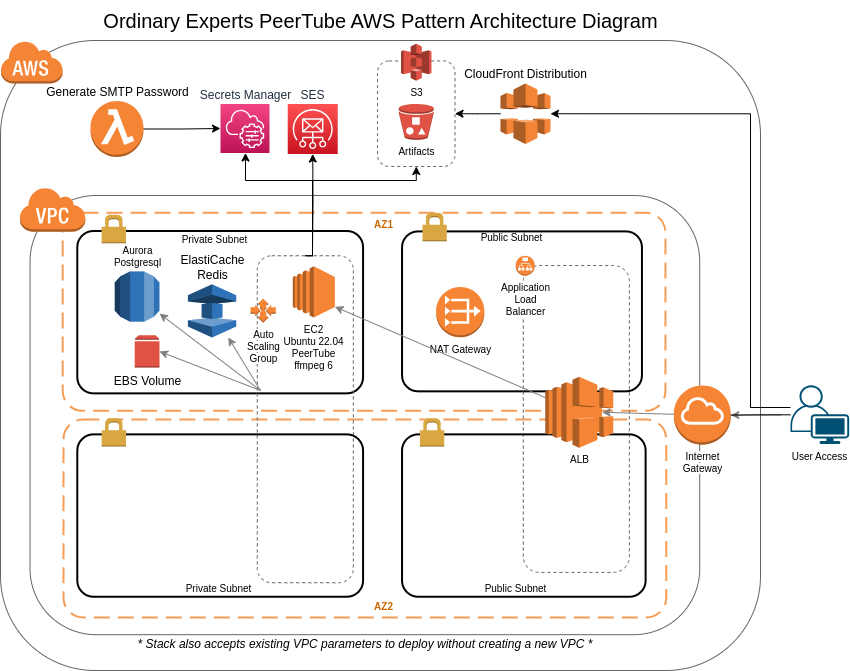

# PeerTube on AWS by FOSSonCloud

A FOSSonCloud AWS Marketplace Product

## AWS Marketplace Product

This product is available on AWS Marketplace. See the [FOSSonCloud product page](https://ordinaryexperts.com/products/peertube-pattern/) for the link to the current Marketplace listing and subscription instructions.

To use it, you'll need to:

1. **Subscribe**: From the AWS Marketplace product listing, click "Continue to Subscribe"
2. **Accept Terms**: Review and accept the terms and conditions
3. **Configure**: Click "Continue to Configuration" to select your region and version
4. **Launch**: Click "Continue to Launch" and choose to launch via CloudFormation

After subscribing, you can launch the CloudFormation template directly from the Marketplace or from your AWS account.

## Overview

PeerTube on AWS by FOSSonCloud is a CloudFormation template with a custom AMI that provisions a production-ready [PeerTube](https://joinpeertube.org/) site — a free, open-source, federated video platform. It uses the following AWS services:

* VPC (operator can pass in VPC info or product can create a VPC)
* EC2 - provisions an Auto Scaling Group with a single Graviton (arm64) instance running PeerTube
* Aurora Postgres - persistent database
* ElastiCache Redis - cache and job queues
* S3 + CloudFront - storage and global delivery of user-generated videos and captions
* SES - sending email
* Route53 - friendly domain names
* ACM - SSL/TLS
* and others...(IAM, Secrets Manager, SSM)

PeerTube is not horizontally scalable in this pattern — the Auto Scaling Group runs as a singleton with a persistent EBS data volume attached to whichever instance is current.

## Architecture Diagram

## How to deploy

### Pre-work

Before deploying the pattern, you will need the following provisioned in the AWS account you are going to use:

* A hosted zone set up in Route53
* A SSL certificate set up in Amazon Certificate Manager

This pattern optionally sets up a SES Domain Identity with EasyDKIM support based on the DNS Hosted Zone that is provided. If this SES Domain Identity already exists, you can set the `SesCreateDomainIdentity` parameter to `false`.

If you are just starting using SES with this product, then be aware your account will start in "sandbox" mode, and will only send emails to verified email identities. You will need to move to SES "production" mode before having general users on your PeerTube site.

See [this AWS information about the SES sandbox](https://docs.aws.amazon.com/ses/latest/dg/request-production-access.html) for more info.

### Deploying

To deploy, [subscribe to the product on AWS Marketplace](#aws-marketplace-product) and then launch the provided CloudFormation template. You can launch directly from the Marketplace interface or use the CloudFormation console.

### Post-deploy setup

After an initial deployment, the initial admin account is bootstrapped using the `AdminEmail` parameter (or `admin@<your-hostname>` if blank). The initial admin password is generated on first boot and stored in AWS Secrets Manager.

To retrieve the admin password:

1. Open the AWS Secrets Manager console.
2. Find the secret named `<stack-name>/instance/credentials`.
3. View `root_password`.

Log in to PeerTube at `https://<your-hostname>/login` and follow the [PeerTube administrator setup guide](https://docs.joinpeertube.org/admin/following-instances) to configure your instance, federation, and admin preferences.

You can connect to the EC2 instance via Session Manager in the AWS console for shell access to the underlying server.
